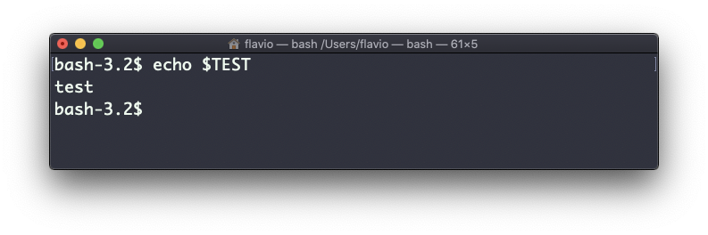
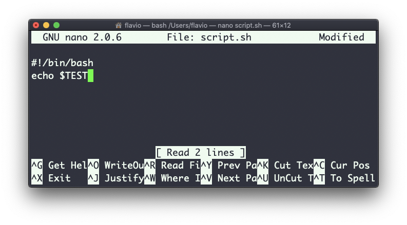
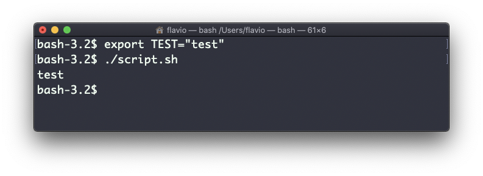

## Linux 中的  `export`  命令

`export`  命令用来向子进程输出变量。

这是什么意思呢？

假设你像下面这样定义一个 TEST 变量：

```
TEST="test"
```

你可以用  `echo $TEST`  输出它的值：



但如果你尝试用以上命令，定义一个名为  `script.sh`  的 Bash 脚本：



然后设定  `chmod u+x script.sh`，并输入  `./script.sh`  执行脚本。此时，再执行  `echo $TEST`  将不会输出任何内容！

这是因为在 Bash 中，`TEST`  被定义为局部变量。当执行一个 Shell 脚本或其他命令时，Bash 会为其单独启动一个子 Shell，这个子 Shell 不会包含当前 Shell 的局部变量。

如果想让变量在子 Shell 中仍然起作用，则不能使用以下命令定义  `TEST` ：

```
TEST="test"
```

而是要这样：

```
export TEST="test"
```

尝试以上命令，然后执行  `./script.sh`，现在 "test" 应该可以输出了：


有时你需要在变量上附加一些内容。这常用于  `PATH`  变量。此时就需要像下面这样：

```
export PATH=$PATH:/new/path
```

当你在终端中直接建立新变量时，通常会使用  `export`。此外，当你在 Bash 的  `.bash_profile`  或  `.bashrc`  配置文件，或 Zsh 的  `.zshenv`  配置文件中定义变量时，也可以使用它

要想删除一个变量，使用  `-n`  参数即可：

```
export -n TEST
```

不带参数调用  `export`，会列举当前已经输出的所有变量。
