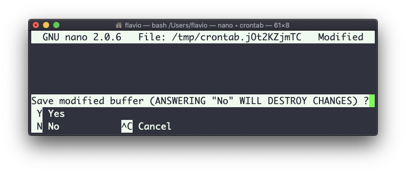

## Linux 中的  `crontab`  命令

Cron 作业通常指定期运行的作业。凭借它们，你可以让任一命令在每小时、每天、每两周或是周末执行。

它们非常强大，特别是在服务器上执行维护或自动化任务时。

`crontab`  命令是处理 Cron 作业的入口。

你能够做的第一件事是探索你定义了哪些 Cron 作业：

```
crontab -l
```

此处你可能像我一样，什么都没见到：


运行

```
crontab -e
```

来编辑已有的 Cron 作业，或是添加新的作业。

默认情况下，它会用系统默认编辑器（通常是  `vim` ）打开。我更喜欢  `nano`。你可以用下面这条命令切换不同的编辑器：

```
EDITOR=nano crontab -e
```

现在，你可以为每个 Cron 作业添加一行配置。

定义作业的语法有些吓人。因此我常用一个网站来帮助我生成配置而不出错：<https://crontab-generator.org/>


此处，你为 Cron 作业选择一个时间间隔，之后输入要执行的命令。

我选择每 12 小时运行来自  `/Users/flavio/test.sh`  的脚本。以下是我需要执行的 crontab 配置行：

```
* */12 * * * /Users/flavio/test.sh >/dev/null 2>&1
```

我运行  `crontab -e`:

```
EDITOR=nano crontab -e
```

然后添加以上配置行，之后按下  `ctrl-X`  然后再按  `y`  保存。

如果一切顺利，那么 Cron 作业就设置好了：


一旦完成，你可以运行以下命令查看当前激活的 Cron 作业列表：

```
crontab -l
```


要删除 Cron 作业，只需再一次运行  `crontab -e` ，删除相应配置行，保存并退出编辑器即可。




