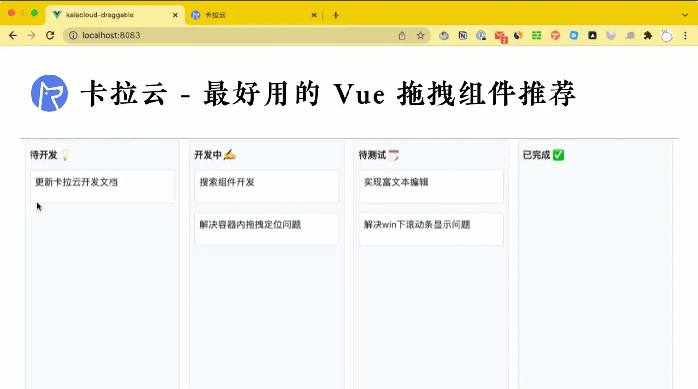

# 拖拽库

- [dnd-kit](https://github.com/clauderic/dnd-kit), [预览](https://master--5fc05e08a4a65d0021ae0bf2.chromatic.com/?path=/story/core-draggable-hooks-usedraggable--basic-setup)

# 拖拽插件

- Vue Draggable - Vue 拖拽组件王者(vue3.3 不兼容)
- Vue drag resize - 轻量级，无依赖，可缩放
- Vue smooth dnd - 简单动效，上下拖拽排序，涵盖多场景
- V-drag - 最简单的可拖拽执行方案
- Vue Easy DnD - 简洁快捷，上下拖拽场景适用
- Awe dnd - 基于 vue 2.x 拖放排序组件，元素和图片拖拽通用

## 1. Vue Draggable - Vue 拖拽组件王者

[Vue.Draggable](https://npm.io/package/vue-draggable) 必须第一个推荐，Vue 拖拽组件里的王者，适应大多数应用场景，流畅顺滑。Vue.Draggable 基于 Sortable.js（一款轻量级拖拽排序 JS 插件） 开发的 Vue 拖拽组件。

- 对移动设备友好支持，支持触控，支持智能滚屏。
- 拖拽与选取文本识别：有时用户会想复制拖拽元素上的文字，多数库无法识别此类用户操作，vue.draggable 可以识别拖拽动作或选择文字的动作。
- 对 Vue UI 库友好，你可以把现有的 Vue 组件附加到可拖拽的元素上，实现这个组件的拖拽功能。

## 2.Vue drag resize - 轻量级，无依赖，可缩放

在线案例：https://kirillmurashov.com/vue-drag-resize/

[vue-drag-resize](https://github.com/kirillmurashov/vue-drag-resize) 支持拖拽和缩放两个大动作，轻量级，无依赖，功能扎实，适合需要缩放的应用场景。

- 无依赖，轻量级
- 操作可联动
- 支持触摸，对移动端友好
- 元素可定义拖拽及缩放
- 可限制拖拽的最大或最小值
- 可限制拖动的方向

## 3. Vue smooth dnd - 简单动效，上下拖拽排序，涵盖多场景

[vue-smooth-dnd](https://github.com/kutlugsahin/vue-smooth-dnd) 是一款简单轻量的拖拽排序 Vue 组件，封装了 smooth-dnd 库。它主要包含两个组件，Draggable 和 Container；Container 包含了可拖动的元素，它的每一个子元素都被 Draggable 包裹着，也就是说，每一个子元素都带有可拖拽的属性。

## 4. v-drag - 最简单的可拖拽执行方案

[v-drag](https://github.com/nil/v-drag) 简单好用的 Vue 拖拽组件，对触摸事件友好支持。作者对 V-drag 的定位是快速让 Vue 集成拖拽功能，让 v-drag 包裹的元素快速实现拖拽移动功能。

## 5.Vue Easy DnD - 简洁快捷，上下拖拽场景适用

[Vue-Easy-DnD](https://github.com/rlemaigre/Easy-DnD) 就如他的名字一样简单快捷，没有任何啰嗦的功能，支持键盘事件，支持 SSR ，支持触摸事件。
