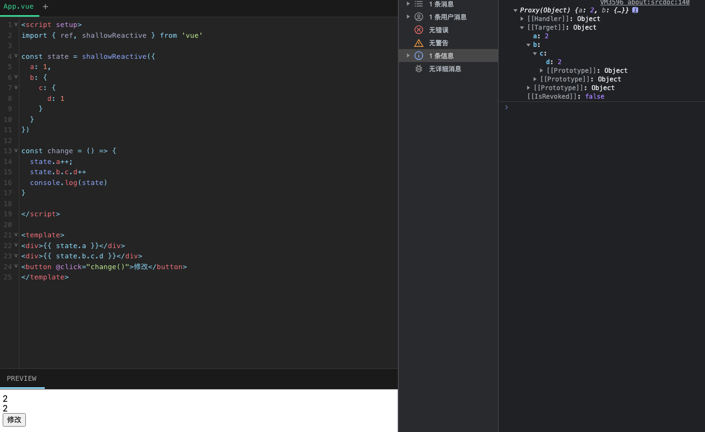

## shallowReactive

只处理对象最`外层属性的响应式`（浅响应式）。它将对象的顶层属性转换为响应式的，但不会处理更深层次的嵌套对象。这在对象结构比较深，但变化时只是外层属性变化的情况下非常有用.

`shallowReactive()`和 `reactive()` 不同，这里没有深层级的转换：一个浅层响应式对象里只有根级别的属性是响应式的。属性的值会被原样存储和暴露，这也意味着值为 ref 的属性不会被自动解包了。

> 
⚠️ 谨慎使用

> 浅层数据结构应该只用于组件中的根级状态。请避免将其嵌套在深层次的响应式对象中，因为它创建的树具有不一致的响应行为，这可能很难理解和调试。

## 示例

但是发现深层的对象数据也是具有响应式的。