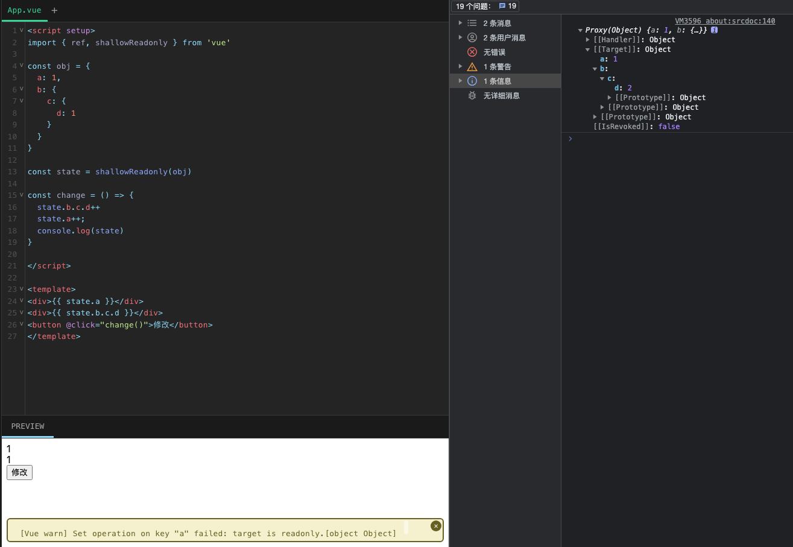

## shallowReadonly
`shallowReadonly` 是一个用于创建一个只读代理的方法，但只将根级别的数据设为只读，不会影响到嵌套的对象。这意味着如果你修改了嵌套的对象，那么 `Vue` 不会抛出错误，因为 `shallowReadonly` 只对根级别的数据进行了只读处理。

## 示例

```js
<script setup>
import { ref, shallowReadonly } from 'vue'

const obj = {
  a: 1,
  b: {
    c: {
      d: 1
    }
  }
}
  
const state = shallowReadonly(obj)

const change = () => {
  state.b.c.d++
  state.a++;
  console.log(state)
}

</script>

<template>
<div>{{ state.a }}</div>
<div>{{ state.b.c.d }}</div>
<button @click="change()">修改</button>
</template>
```
可以看到`[Vue warn] Set operation on key "a" failed: target is readonly.[object Object]`,a属性是不可以修改的，但是d属性是可以修改，但不是响应式数据
