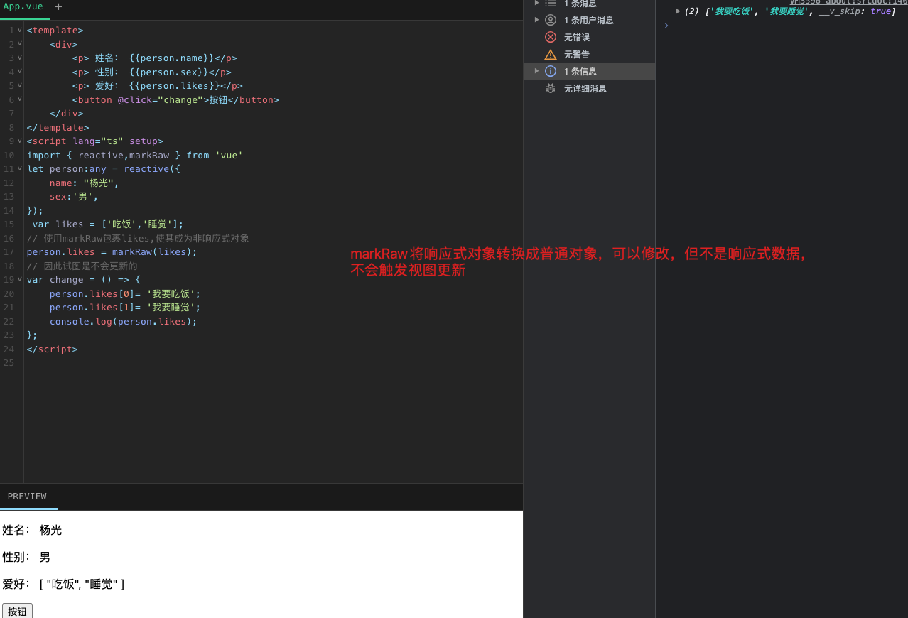

## markRaw
`markRaw`是一个非常有用的函数。它的作用是将一个对象标记为不可以被转化为代理对象，并返回该对象本身。换句话说，使用`markRaw`包装的对象将不会是响应式的，因此任何对其进行的更改都不会触发视图的更新.


markRaw的常见应用场景包括：

- 有些值不应被设置成响应式的，例如复杂的第三方类库等
- 当渲染具有不可变数据源的大列表时，跳过响应式转换可以提高性能
- 在动态渲染组件的时候我们就可以使用 markRaw 包裹

## 示例

```js
<template>
    <div>
        <p> 姓名： {{person.name}}</p> 
        <p> 性别： {{person.sex}}</p> 
        <p> 爱好： {{person.likes}}</p> 
        <button @click="change">按钮</button>
    </div>
</template>
<script lang="ts" setup>
import { reactive,markRaw } from 'vue'
let person:any = reactive({
    name: "杨光",
    sex:'男',
});
 var likes = ['吃饭','睡觉'];
// 使用markRaw包裹likes,使其成为非响应式对象
person.likes = markRaw(likes);
// 因此试图是不会更新的
var change = () => {
    person.likes[0]= '我要吃饭';
    person.likes[1]= '我要睡觉';
    console.log(person.likes);
};
</script>

```

被`markRaw`包装的对象就不再是响应式数据了，但是可以进行修改.

