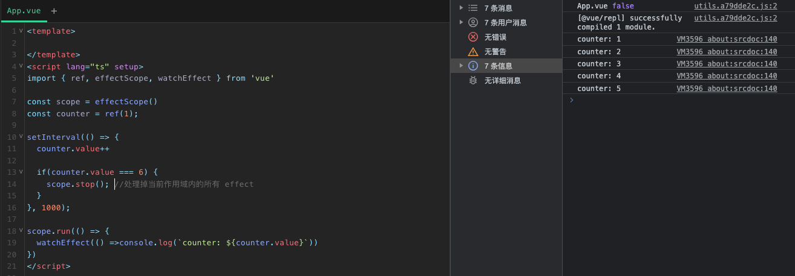

## effectScope

`effectScope` 是 `Vue 3.2.0` 引入的新 API，主要用于响应式系统的高阶内容。字面上理解，它就是 `effect` 作用域，用于收集在其中所创建的副作用，并能对其进行统一的处理.

1、如何理解 effectScope

在 `Vue` 的 `setup` 中，响应会在开始初始化的时候被收集，而在实例被卸载的时候，响应就会自动的被取消追踪了。这是一个很方便的特性。但是，当我们在组件外使用或者编写一个独立的包时，这会变得非常麻烦。当在单独的文件中，我们该如何停止 `computed` 和 `watch` 的响应式依赖呢？这时候，`EffectScope` 就派上用场了。实际上 `EffectScope` 按我的理解就是副作用生效的作用域。`Vue3` 对响应式的监听是通过 `effect` 实现的，当我们的组件销毁的时候，`Vue` 会自动取消该组件的 `effect`.

## 示例
一个 scope 可以执行一个 run 函数（接受一个函数作为参数，并返回该函数的返回值），并且捕获所有在该函数执行过程中创建的 effect ，包括可以创建 effect 的API，例如 computed , watch , watchEffect
```js
<script lang="ts" setup>
import { ref, effectScope, watchEffect } from 'vue'
  
const scope = effectScope()
const counter = ref(1);
  
setInterval(() => {
  counter.value++
  
  if(counter.value === 6) {
    scope.stop(); //处理掉当前作用域内的所有 effect
  }
}, 1000);

scope.run(() => {
  watchEffect(() =>console.log(`counter: ${counter.value}`))
})
</script>
```

当调用 scope.stop(), 所有被捕获的effect都会被取消，包括 nested Scopes 也会被递归取消




## Nested Scopes
嵌套scope也会被他们的父级scope收集。并且当父级scope销毁的时候，所有的后代scope也会被递归销毁。

```js
const scope = effectScope()

scope.run(() => {
  const doubled = computed(() => counter.value * 2)

  // not need to get the stop handler, it will be collected by the outer scope
  effectScope().run(() => {
    watch(doubled, () => console.log(doubled.value))
  })

  watchEffect(() => console.log('Count: ', doubled.value))
})

// dispose all effects, including those in the nested scopes
scope.stop()

```

## Detached Nested Scopes
effectScope 接受一个参数可以在分离模式（detached mode）下创建。 detached scope不会被父级collect。

```js
let nestedScope

const parentScope = effectScope()

parentScope.run(() => {
  const doubled = computed(() => counter.value * 2)

  // with the detected flag,
  // the scope will not be collected and disposed by the outer scope
  nestedScope = effectScope(true /* detached */)
  nestedScope.run(() => {
    watch(doubled, () => console.log(doubled.value))
  })

  watchEffect(() => console.log('Count: ', doubled.value))
})

// disposes all effects, but not `nestedScope`
parentScope.stop()

// stop the nested scope only when appropriate
nestedScope.stop()

```