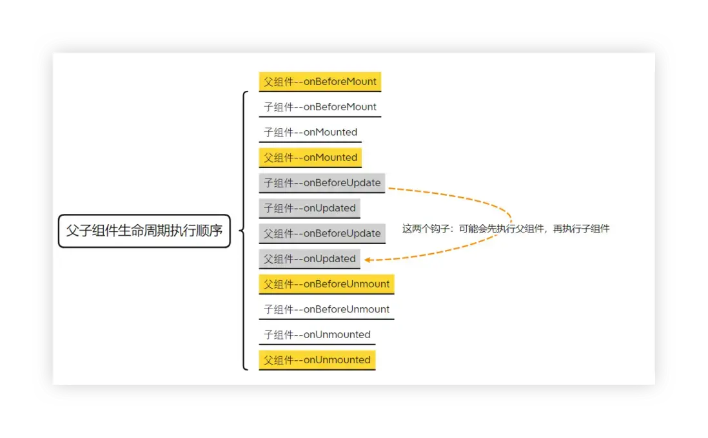

## 生命周期 2.x 与 Composition 之间的映射关系

```
beforeCreate -> use setup()
created -> use setup()
beforeMount -> onBeforeMount
mounted -> onMounted
beforeUpdate -> onBeforeUpdate
updated -> onUpdated
beforeDestroy -> onBeforeUnmount
destroyed -> onUnmounted
errorCaptured -> onErrorCaptured
```

源码查看

```js
export const onBeforeMount = createLifeCycle("beforeMount");
export const onMounted = createLifeCycle("mounted");
export const onBeforeUpdate = createLifeCycle("beforeUpdate");
export const onUpdated = createLifeCycle("updated");
export const onBeforeUnmount = createLifeCycle("beforeDestroy");
export const onUnmounted = createLifeCycle("destroyed");
export const onActivated = createLifeCycle("activated");
export const onDeactivated = createLifeCycle("deactivated");
export const onServerPrefetch = createLifeCycle("serverPrefetch");
```

## 父子组件生命周期加载顺序



## 生命周期函数，可以按需导入到组件中，且只能在 setup()函数中使用

```js
<script setup>
  import { onMounted, onUnmounted } from 'vue';
  export default {
      setup () {
          onMounted(()=>{
            //
          });

          onUnmounted(()=> {
              //
          });
      }
  };
</script>
```

## onMounted

注册一个回调函数，在组件挂载完成后执行。组件在以下情况下被视为已挂载：

- 其所有同步子组件都已经被挂载 (不包含异步组件或 <Suspense/> 树内的组件)。
- 其自身的 DOM 树已经创建完成并插入了父容器中。注意仅当根容器在文档中时，才可以保证组件 DOM 树也在文档中。

示例

```vue
<script setup>
import { ref, onMounted } from "vue";

const el = ref();

onMounted(() => {
  el.value; // <div>
});
</script>

<template>
  <div ref="el"></div>
</template>
```

## onUpdated

注册一个回调函数，在组件因为响应式状态变更而更新其 DOM 树之后调用。父组件的更新钩子将在其子组件的更新钩子之后调用。

这个钩子会在组件的任意 DOM 更新后被调用，这些更新可能是由不同的状态变更导致的，因为多个状态变更可以在同一个渲染周期中批量执行（考虑到性能因素）。如果你需要在某个特定的状态更改后访问更新后的 DOM，请使用 nextTick() 作为替代。

不要在 updated 钩子中更改组件的状态，这可能会导致无限的更新循环！

示例

```js
<script setup>
import { ref, onUpdated } from 'vue'

const count = ref(0)

onUpdated(() => {
  // 文本内容应该与当前的 `count.value` 一致
  console.log(document.getElementById('count').textContent)
})
</script>

<template>
  <button id="count" @click="count++">{{ count }}</button>
</template>
```

## onUnmounted

注册一个回调函数，在组件实例被卸载之后调用。一个组件在以下情况下被视为已卸载：

- 其所有子组件都已经被卸载。
- 有相关的响应式作用 (渲染作用以及 setup() 时创建的计算属性和侦听器) 都已经停止。

可以在这个钩子中手动清理一些副作用，例如计时器、DOM 事件监听器或者与服务器的连接。

示例

```js
<script setup>
  import {(onMounted, onUnmounted)} from 'vue' let intervalId onMounted(() =>{" "}
  {
    (intervalId = setInterval(() => {
      // ...
    }))
  }
  ) onUnmounted(() => clearInterval(intervalId))
</script>
```

## onBeforeMount

注册一个钩子，在组件被挂载之前被调用。

当这个钩子被调用时，组件已经完成了其响应式状态的设置，但还没有创建 DOM 节点。它即将首次执行 DOM 渲染过程。

这个钩子在服务器端渲染期间不会被调用。

## onBeforeUpdate

注册一个钩子，在组件即将因为响应式状态变更而更新其 DOM 树之前调用。

这个钩子可以用来在 Vue 更新 DOM 之前访问 DOM 状态。在这个钩子中更改状态也是安全的。

这个钩子在服务器端渲染期间不会被调用。

## onBeforeUnmount

注册一个钩子，在组件实例被卸载之前调用。

当这个钩子被调用时，组件实例依然还保有全部的功能。

这个钩子在服务器端渲染期间不会被调用。

## onErrorCaptured

注册一个钩子，在捕获了后代组件传递的错误时调用。错误可以从以下几个来源中捕获：

- 组件渲染
- 事件处理器
- 生命周期钩子
- setup() 函数
- 侦听器
- 自定义指令钩子
- 过渡钩子

这个钩子带有三个实参：错误对象、触发该错误的组件实例，以及一个说明错误来源类型的信息字符串

错误传递规则

- 默认情况下，所有的错误都会被发送到应用级的 app.config.errorHandler (前提是这个函数已经定义)，这样这些错误都能在一个统一的地方报告给分析服务。

- 如果组件的继承链或组件链上存在多个 errorCaptured 钩子，对于同一个错误，这些钩子会被按从底至上的顺序一一调用。这个过程被称为“向上传递”，类似于原生 DOM 事件的冒泡机制。

- 如果 errorCaptured 钩子本身抛出了一个错误，那么这个错误和原来捕获到的错误都将被发送到 app.config.errorHandler。

- errorCaptured 钩子可以通过返回 false 来阻止错误继续向上传递。即表示“这个错误已经被处理了，应当被忽略”，它将阻止其他的 errorCaptured 钩子或 app.config.errorHandler 因这个错误而被调用。

## onRenderTracked

注册一个调试钩子，当组件渲染过程中追踪到响应式依赖时调用。

这个钩子仅在开发模式下可用，且在服务器端渲染期间不会被调用。

类型

```js
function onRenderTracked(callback: DebuggerHook): void

type DebuggerHook = (e: DebuggerEvent) => void

type DebuggerEvent = {
  effect: ReactiveEffect
  target: object
  type: TrackOpTypes /* 'get' | 'has' | 'iterate' */
  key: any
}
```

## onRenderTriggered

注册一个调试钩子，当响应式依赖的变更触发了组件渲染时调用。

这个钩子仅在开发模式下可用，且在服务器端渲染期间不会被调用。

```js
function onRenderTriggered(callback: DebuggerHook): void

type DebuggerHook = (e: DebuggerEvent) => void

type DebuggerEvent = {
  effect: ReactiveEffect
  target: object
  type: TriggerOpTypes /* 'set' | 'add' | 'delete' | 'clear' */
  key: any
  newValue?: any
  oldValue?: any
  oldTarget?: Map<any, any> | Set<any>
}
```

## onActivated

注册一个回调函数，若组件实例是 <KeepAlive/> 缓存树的一部分，当组件被插入到 DOM 中时调用。

这个钩子在服务器端渲染期间不会被调用。

## onDeactivated

注册一个回调函数，若组件实例是 <KeepAlive/> 缓存树的一部分，当组件从 DOM 中被移除时调用。

这个钩子在服务器端渲染期间不会被调用。

## onServerPrefetch

注册一个异步函数，在组件实例在服务器上被渲染之前调用。

如果这个钩子返回了一个 Promise，服务端渲染会在渲染该组件前等待该 Promise 完成。

这个钩子仅会在服务端渲染中执行，可以用于执行一些仅存在于服务端的数据抓取过程。

```js
<script setup>
import { ref, onServerPrefetch, onMounted } from 'vue'

const data = ref(null)

onServerPrefetch(async () => {
  // 组件作为初始请求的一部分被渲染
  // 在服务器上预抓取数据，因为它比在客户端上更快。
  data.value = await fetchOnServer(/* ... */)
})

onMounted(async () => {
  if (!data.value) {
    // 如果数据在挂载时为空值，这意味着该组件
    // 是在客户端动态渲染的。将转而执行
    // 另一个客户端侧的抓取请求
    data.value = await fetchOnClient(/* ... */)
  }
})
</script>
```
