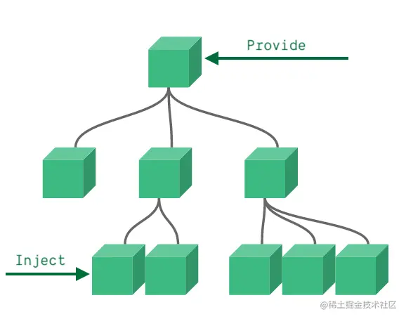

## 依赖注入

Vue3的provide和inject用于实现跨级组件间的数据传递，也就是祖先组件向后代组件提供数据，而后代组件可以选择接收。这种方式避免了多层级组件间通过props逐层传递数据的繁琐

父组件可以作为其所有子组件的依赖项提供程序，而不管组件层次结构有多深。这个特性有两个部分：父组件有一个 provide 选项来提供数据，子组件有一个 inject 选项来开始使用这个数据。

## provide()

`provide`可以在组件中使用，主要用于提供数据。它接收两个参数：第一个参数是注入键（可以是`字符串`或`Symbol`），用于后代组件查找需要注入的值；第二个参数是提供的值，可以是任何类型，包括响应式状态，如`refs`。

在setup函数中使用provide：

```js
import { provide, ref } from 'vue'
export default {
  setup() {
    const message = ref(0)
    provide('message', message)
  }
}
```

也可以在创建应用时，进行全局的数据提供：

```js
import { createApp, ref } from 'vue'
const app = createApp({})
const message = ref(0)
app.provide('message', message)
```
此时，所提供的数据对整个应用中的所有组件都可用，这对于编写插件特别有用，因为插件通常无法使用组件提供值

## inject()

`inject`用于在后代组件中接收由祖先组件提供的数据。它接收两个参数：第一个参数是提供的键，第二个参数是默认值（可选）

```js
import { inject } from "vue"
export default {
  setup() {
    const message = inject('message')
    console.log(message) // 0
  }
}
```
需要注意的是，inject只能在setup函数或函数式组件中使用

## 使用Symbol作为键

为了避免键名冲突，可以使用Symbol作为键。并且可以使用Vue3提供的InjectionKey接口来为注入的数据标记类型，这样在注入数据的时候，就能进行类型检查，在获取的时候返回的就是定义的类型，不用通过泛型去接受或者强转。

```js
import { InjectionKey, Ref } from 'vue';
export interface Person {
    name: string,
    age: number
}
export const key = Symbol() as InjectionKey<Ref<Person>>;

```