# 前言
Vue 3.3 的这次发布主要是为了改进 DX （开发者体验），新增了一些语法糖和宏，以及 TypeScript 上的改善。

- 泛型组件
- 在 SFC（单文件组件）中导入外部 TS 类型
- defineSlots 来定义插槽的类型
- defineEmits 更便捷的语法
- defineOptions 定义组件选项
- (试验性) 响应式的 props 解构
- (试验性) defineModel 语法糖
- 废弃 Reactivity Transform


# 泛型组件(Generic Component)

泛型的目的和意义:泛型的目的是——约束！泛型相当于制定了一个白名单，名单里面的类型可以传，不在名单里面的不可以传。TS 的泛型可以帮助我们更准确的推断类型，从而在编写代码的时候，可以有更准确的提示和提供验证依据。

组件的props可以设置各种类型，那么如果想用泛型的话，要如何设置呢？这就需要使用 Generic：

```ts
<script setup lang="ts" generic="T extends {name: string} ">
   
const props = defineProps<{
  list: T[], // 泛型的方式
  list2: number[], // 只能是 number 类型的数组
  list3: Array<any>, // 任意类型的数组
  name: string,
  person: {
    name: string
  }
}>()

console.log('props-ts:\n', props)
```

这里定义了几个属性，第一个使用了泛型，第二个是 number[]，第三个是任意类型的数组。

我们来看看不同类型的提示信息：

1、Array<any/> 提示的时候，无法获知具体的类型。

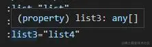

2、number[] 必须和设置的类型完全一致。

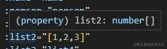

3、T[] 可以根据传入的类型做出对应的提示

传入 {name: string}

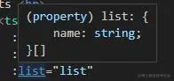

传入 {name: string, age: number}

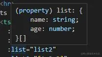

类型不匹配的提示

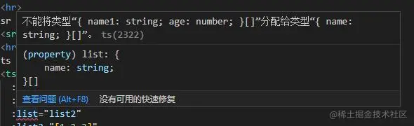

对比一下，我们可以发现，使用泛型可以准确的推断类型，在模板里面可以有更准确的提示，如果类型不合格，可以有提示信息。
这样在编写代码的时候可以避免低级错误。


```
此功能在最新版本的volar/vue-tsc中默认启用。

# 在 SFC（单文件组件）中导入外部 TS 类型

1、 在接收父亲组件接收的参数时，我们一般使用defineProps，原来接收的方式:

  ```ts
  <template>
    <HelloWorld :msg="['1']" />
  </template>

  <script setup lang="ts">
    import HelloWorld from "@/components/HelloWorld.vue";
  </script>
  ```

2、 子组件,非TS方式，可以看到提示unknown[]

```js
<script setup>
  const props = defineProps({
    msg: {
      type: Array,
      require: true
    },
  });

  props.msg;
</script>
```

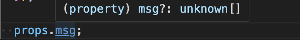

3、 子组件，TS方式，我们需引入PropType来限定数据类型

```ts
<script setup lang="ts">
  import type { PropType } from "vue";

  const props = defineProps({
    msg: {
      type: Array as PropType<string[]>,
      require: true,
    },
  });

  props.msg;
</script>
```
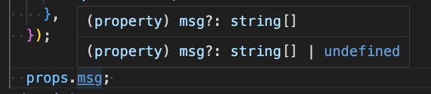

4、 子组件，TS方式，子面量方式

```ts
<script setup lang="ts">
  const props = defineProps<{
    msg: string[];
  }>();

  props.msg;
</script>
```
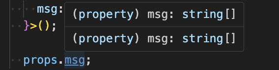

5、 vue3.3新方式

vue3.3对defineProps的改进 新增反省支持需要在script标签加上generic='T'

```ts
<script generic="T" setup lang="ts">
  const props = defineProps<{
    msg: T[];
  }>();

  props.msg;
</script>
```
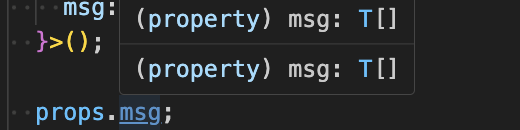


6. 使用的组件`script setup`支持范型和继承

```ts
<script setup lang="ts" generic="T">
defineProps<{
  items: T[]
  selected: T
}>()
</script>

```

```ts
<script setup lang="ts" generic="T extends string | number, U extends Item">
import type { Item } from './types'
defineProps<{
  id: T
  list: U[]
}>()
</script>

# defineSlots 来定义插槽的类型

1、父组件
```ts
<template>
  <div>
    <Child :data="list">
      <template #default="{item}">
          <div>{{ item.name }}</div>
      </template>
    </Child>
  </div>
</template>
<script lang='ts' setup>
import Child from './views/child.vue'
const list = [
  {
    name: "张三"
  },
  {
    name: "李四"
  },
  {
    name: "王五"
  }
]
</script>
```

子组件 defineSlots只做声明不做实现 同时约束slot类型

```ts
<template>
 <div>
    <ul>
      <li v-for="(item,index) in data">
        <slot :index="index" :item="item"></slot>
      </li>
    </ul>
 </div>
</template>
 <script generic="T"  lang='ts' setup>
defineProps<{
    data: T[]
}>()
defineSlots<{
   default(props:{item:T,index:number}):void
}>()
</script>

```


7、defineProps使用引入外部定义的接口

父组件
```ts
// App.vue
<script setup lang='ts'>
// 定义接口并暴露出去
export interface Command {
  msg: string
}
const count = ref(0)
</script>

<template>
  <button @click="count ++">change count</button>
  <Child :msg="'hello vue3.3'" :count="count" />
</template>

```

子组件
```ts
// Child.vue
<script setup lang='ts'>
import { Command } from '../App.vue';
defineProps<Command & { count: number}>()
</script>

<template>
  <h1>{{ msg }}</h1>
  <div>{{ count }}</div>
</template>

```

效果如下

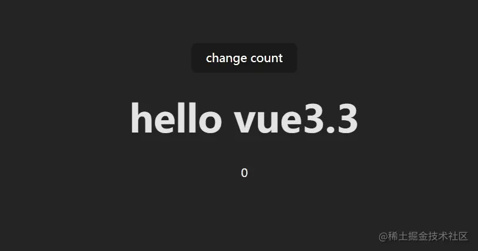


2、案例

在组件里面定义两个插槽，一个是匿名插槽，一个是作用域插槽（col）。

定义一个 list 的属性，传入一个数组，然后遍历这个数组，创建一组列表，列表内使用作用域插槽。

通过作用域插槽的props把数组元素传递给父组件：

```ts
<script setup lang="ts" generic="T extends Object ">
  
  const props = defineProps<{
    list: T[], // 泛型的方式
  }>()

  const slot = defineSlots<{
    default(props: any): any,
    col(props:
      {
        row: T,
        index: number
      }): any
  }>()
  console.log('slot:\n', slot)

```

```ts
<template>
  <!--匿名插槽-->
  <slot></slot>
  <div v-for="(item, index) in list" :key="index">
    <!--作用域插槽-->
    <slot name="col" :row="item" :index="index" ></slot>
  </div>
</template>

```

父组件使用

```ts
<script setup lang="ts">
  import { reactive } from 'vue'
  // 加载子组件
  import ts from './20-ts.vue'
  // 定义数组
  const list2 = reactive([
    {
      name: '11',
      age: 10
    },
    {
      name: '66',
      age: 10
    }
  ])
</script>


<template>
  <ts :list="list2" > <!--传入数据列表-->
    <h1>测试插槽</h1>
    <template #col="{ item, index }"> <!--用解构的方式获取-->
      序号：{{ index }}<br> <!--其实这里是循环-->
      内容：{{ item }}
    </template>
  </ts>
</template>

```

UI库里的 table 组件一般都会支持这样的插槽，以便于灵活设置列表，比如 el-table 的 el-table-column：

(来自官网示例代码)
```ts
<el-table :data="tableData" style="width: 100%">
    <el-table-column label="日期" width="180">
      <template #default="scope">
        <div style="display: flex; align-items: center">
          <el-icon><timer /></el-icon>
          <span style="margin-left: 10px">{{ scope.row.date }}</span>
        </div>
      </template>
    </el-table-column>
    ...
  </el-table>

```

这里的 default 就是一个匿名作用域插槽，可以通过scope.row获得每一行的数据。

# defineEmits 更便捷的语法

1、父组件

```ts
<script setup lang="ts">
  import HelloWorld from "@/components/HelloWorld.vue";

  const onClick = (name: string, age?: number) => {
    console.log("onClick", name, age);
  };
</script>

<template>
  <HelloWorld @click="onClick" />
</template>
```

2. 子组件派发`emit`，非TS方式

```ts
<script  setup lang="ts">
  const emit = defineEmits(["click"]);

  const send = () => {
    emit("click", 'hello world', 2);
  };
</script>

<template>
  <button @click="send">派发事件</button>
</template>
```

2. 子组件派发`emit`，TS字面量方式

```ts
<script  setup lang="ts">
  // event:派发事件名 name:必传参数 age:选传参数
  const emit = defineEmits<{
    (event: "click", name: string, age?: number): void;
  }>();

  const send = () => {
    emit("click", "hello world");
  };
</script>

<template>
  <button @click="send">派发事件</button>
</template>
```

3.vue3.3新方式

```ts
<script  setup lang="ts">
  const emit = defineEmits<{
    click: [name: string];
  }>();

  const send = () => {
    emit("click", "hello world");
  };
</script>
```

# defineOptions 定义组件选项

[传送门](http://www.alongweb.top/vue3/index37.html#defineoptions-3-3)

# (试验性) 响应式的 props 解构

该功能允许解构的数据保留反应性，并提供更符合人体工程学的方式来声明道具默认值：

```ts
<script setup>
import { watchEffect } from 'vue'

const { msg = 'hello' } = defineProps(['msg'])

watchEffect(() => {
  // accessing `msg` in watchers and computed getters
  // tracks it as a dependency, just like accessing `props.msg`
  console.log(`msg is: ${msg}`)
})
</script>

<template>{{ msg }}</template>

```

[RFC](https://github.com/vuejs/rfcs/discussions/502)

# (试验性) defineModel 语法糖

以前，对于支持双向绑定的组件`v-model`，它需要声明一个`prop`和`update:propName`在它打算更新 `prop` 时发出相应的事件：

```ts
<!-- BEFORE -->
<script setup>
const props = defineProps(['modelValue'])
const emit = defineEmits(['update:modelValue'])
console.log(props.modelValue)

function onInput(e) {
  emit('update:modelValue', e.target.value)
}
</script>

<template>
  <input :value="modelValue" @input="onInput" />
</template>

```

vue3.3 简化了`defineModel`。宏会自动注册一个 `prop`，并返回一个可以直接改变的 `ref`：

```ts
<!-- AFTER -->
<script setup>
const modelValue = defineModel()
console.log(modelValue.value)
</script>

<template>
  <input v-model="modelValue" />
</template>

```

`案例`

我们使用defineModel定义一个model，绑定在input标签上，同时使用watch监听变化。

父组件

```ts
// App.vue
<script setup lang="ts">
const modal = ref('hello world')
</script>
<template>
  <Child v-model="modal" />
</template>

```

子组件

```ts
// Child.vue
<template>
  <input v-model="modelValue" />
</template>
  
<script setup lang='ts'>
const modelValue = defineModel<string>()
watch(() => modelValue.value, (val) => console.log(val))
</script>
```

效果如下

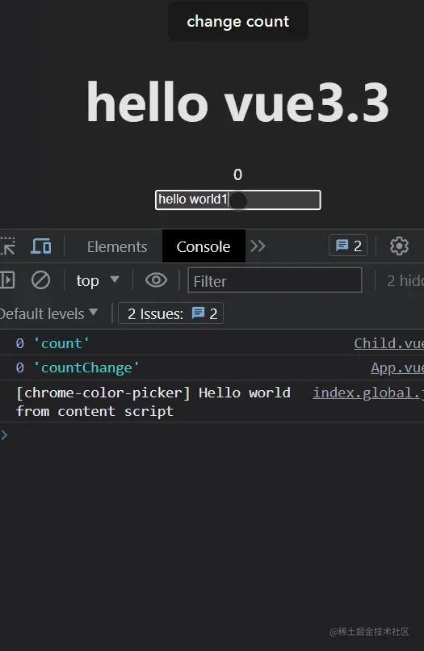

[RFC](https://github.com/vuejs/rfcs/discussions/503)

# 废弃 Reactivity Transform