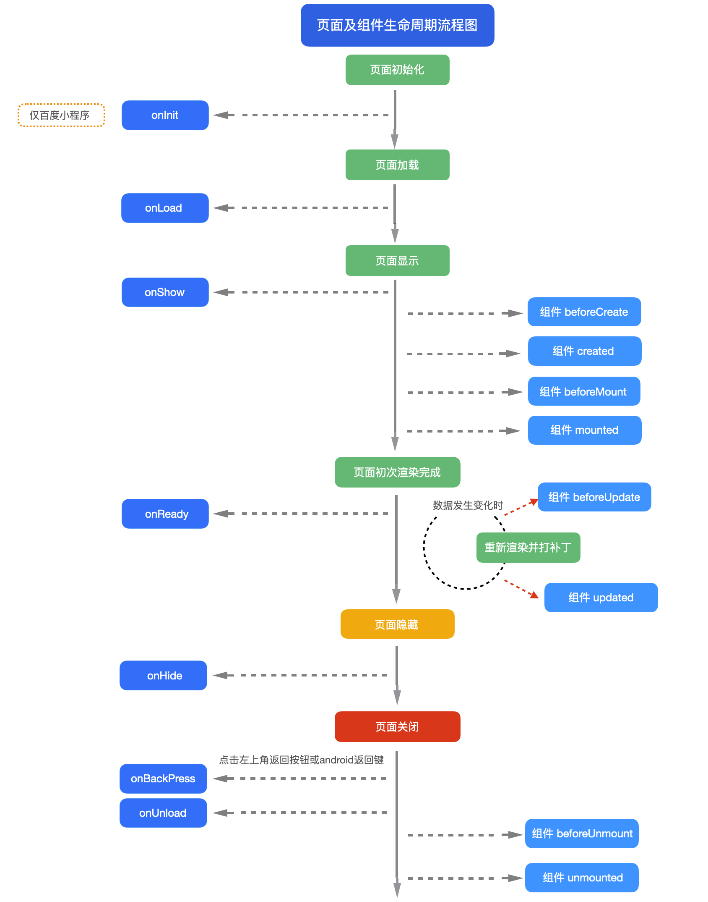

## 页面内容构成

uni-app 页面基于 vue 规范。一个页面内，有 3 个根节点标签：

- 模板组件区 `template`
- 脚本区 `script`
- 样式区 `style`

```vue
<template></template>

<script lang="ts" setup></script>

<style lang="scss"></style>
```

## Vue3 页面及组件生命周期流程图



## onReachBottom

可在 pages.json 里定义具体页面底部的触发距离[onReachBottomDistance](https://uniapp.dcloud.net.cn/collocation/pages.html#globalstyle)，比如设为 50，那么滚动页面到距离底部 50px 时，就会触发 onReachBottom 事件。

如使用 scroll-view 导致页面没有滚动，则触底事件不会被触发。scroll-view 滚动到底部的事件请参考 scroll-view 的文档。

## onPageScroll

| 属性      | 类型   | 说明                                  |
| --------- | ------ | ------------------------------------- |
| scrollTop | Number | 页面在垂直方向已滚动的距离（单位 px） |

```vue
onPageScroll : function(e) { //nvue暂不支持滚动监听，可用bindingx代替
console.log("滚动距离为：" + e.scrollTop); }
```

注意

- `onPageScroll`里不要写交互复杂的 js，比如频繁修改页面。因为这个生命周期是在渲染层触发的，在非 h5 端，js 是在逻辑层执行的，两层之间通信是有损耗的。如果在滚动过程中，频发触发两层之间的数据交换，可能会造成卡顿。（uvue 在 app 端无此限制）
- 在 webview 渲染时，比如 app-vue、微信小程序、H5 中，也可以使用[wxs](https://uniapp.dcloud.net.cn/tutorial/miniprogram-subject.html#wxs)监听滚动，参考；在 app-nvue 中，可以使用[bindingx](https://uniapp.dcloud.net.cn/tutorial/nvue-api.html#nvue-%E9%87%8C%E4%BD%BF%E7%94%A8-bindingx)监听滚动，参考。
- 如果想实现滚动时标题栏透明渐变，在 App 和 H5 下，可在 pages.json 中配置 titleNView 下的 type 为 transparent，[参考](https://uniapp.dcloud.net.cn/collocation/pages.html#app-titlenview)。(uni-app x 不支持)
- 如果需要滚动吸顶固定某些元素，推荐使用 css 的粘性布局，参考[插件市场](https://ext.dcloud.net.cn/plugin?id=715)。插件市场也有其他 js 实现的吸顶插件，但性能不佳，需要时可自行搜索。（uni-app x 可自由在 uts 中设置固定位置）

## onBackPress

| 属性 | 类型   | 说明                                                                                                                                    |
| ---- | ------ | --------------------------------------------------------------------------------------------------------------------------------------- |
| from | String | 触发返回行为的来源：'backbutton'——左上角导航栏按钮及安卓返回键；'navigateBack'——uni.navigateBack() 方法。支付宝小程序端不支持返回此字段 |

```vue
export default { onBackPress(options) { console.log('from:' + options.from) } }
```

注意

- onBackPress 上不可使用 async，会导致无法阻止默认返回
- 支付宝小程序只有真机可以监听到非 navigateBack 引发的返回事件（使用小程序开发工具时不会触发 onBackPress），不可以阻止默认返回行为

详细说明及使用：onBackPress [详解](https://ask.dcloud.net.cn/article/35120)

## onTabItemTap

| 属性     | 类型   | 说明                             |
| -------- | ------ | -------------------------------- |
| index    | Number | 被点击 tabItem 的序号，从 0 开始 |
| pagePath | String | 被点击 tabItem 的页面路径        |
| text     | String | 被点击 tabItem 的按钮文字        |

```vue
onTabItemTap : function(e) { console.log(e); // e的返回格式为json对象：
{"index":0,"text":"首页","pagePath":"pages/index/index"} }
```

- onTabItemTap 常用于点击当前 tabitem，滚动或刷新当前页面。如果是点击不同的 tabitem，一定会触发页面切换。
- 如果想在 App 端实现点击某个 tabitem 不跳转页面，不能使用 onTabItemTap，可以使用[plus.nativeObj.view](https://www.html5plus.org/doc/zh_cn/nativeobj.html)放一个区块盖住原先的 tabitem，并拦截点击事件。
- 支付宝小程序平台 onTabItemTap 表现为点击非当前 tabitem 后触发，因此不能用于实现点击返回顶部这种操作

## onNavigationBarButtonTap

| 属性  | 类型   | 说明                     |
| ----- | ------ | ------------------------ |
| index | Number | 原生标题栏按钮数组的下标 |

```vue
onNavigationBarButtonTap : function (e) { console.log(e); //
e的返回格式为json对象：{"text":"测试","index":0} }
```

## 页面调用接口

#### getApp()

`getApp()` 函数用于获取当前应用实例，一般用于获取 globalData。也可通过应用实例调用 App.vue methods 中定义的方法。

```vue
const app = getApp() console.log(app.globalData) app.doSomething() // 调用
App.vue methods 中的 doSomething 方法
```

#### getCurrentPages()

`getCurrentPages()` 函数用于获取当前页面栈的实例，以数组形式按栈的顺序给出，数组中的元素为页面实例，第一个元素为首页，最后一个元素为当前页面。

每个页面实例的方法属性列表：

| 方法                  | 描述                            | 平台说明 |
| --------------------- | ------------------------------- | -------- |
| page.$getAppWebview() | 获取当前页面的 webview 对象实例 | App      |
| page.route            | 获取当前页面的路由              |          |

## 页面通讯

#### uni.$emit(eventName,OBJECT)

触发全局的自定义事件。附加参数都会传给监听器回调。

| 方法      | 类型   | 描述                   |
| --------- | ------ | ---------------------- |
| eventName | String | 事件名                 |
| OBJECT    | Object | 触发事件携带的附加参数 |

```vue
uni.$emit('update',{msg:'页面更新'})
```

#### uni.$on(eventName,callback)

监听全局的自定义事件。事件可以由 uni.$emit 触发，回调函数会接收所有传入事件触发函数的额外参数。

| 方法      | 类型     | 描述           |
| --------- | -------- | -------------- |
| eventName | String   | 事件名         |
| callback  | Function | 事件的回调函数 |

```vue
uni.$on('update',function(data){ console.log('监听到事件来自 update ，携带参数
msg 为：' + data.msg); })
```

#### uni.$once(eventName,callback)

监听全局的自定义事件。事件可以由 uni.$emit 触发，但是只触发一次，在第一次触发之后移除监听器。

| 方法      | 类型     | 描述           |
| --------- | -------- | -------------- |
| eventName | String   | 事件名         |
| callback  | Function | 事件的回调函数 |

```vue
uni.$once('update',function(data){ console.log('监听到事件来自 update ，携带参数
msg 为：' + data.msg); })
```

#### uni.$off([eventName, callback])

移除全局自定义事件监听器。

| 方法      | 类型               | 描述           |
| --------- | ------------------ | -------------- |
| eventName | Array ＜ String ＞ | 事件名         |
| callback  | Function           | 事件的回调函数 |

## 路由

`uni-app` 通过 `pages` 节点配置应用由哪些页面组成，`pages` 节点接收一个数组，数组每个项都是一个对象，其属性值如下：

| 属性      | 类型    | 默认值 | 描述                                       |
| --------- | ------- | ------ | ------------------------------------------ |
| path      | String  |        | 配置页面路径                               |
| style     | Object  |        | 配置页面窗口表现，配置项参考下方 pageStyle |
| needLogin | Boolean | false  | 是否需要登录才可访问                       |

```json
{
    "pages": [
        {
            "path": "pages/index/index",
            "style": { ... }
        }, {
            "path": "pages/login/login",
            "style": { ... }
        }
    ]
}
```

#### style

页面中配置项会覆盖  [globalStyle](https://uniapp.dcloud.net.cn/collocation/pages#globalstyle)  中相同的配置项

| 属性                         | 类型     | 默认值  | 描述                                                                                                                                                                                          | 平台差异说明                                               |
| ---------------------------- | -------- | ------- | --------------------------------------------------------------------------------------------------------------------------------------------------------------------------------------------- | ---------------------------------------------------------- |
| navigationBarBackgroundColor | HexColor | #F8F8F8 | 导航栏背景颜色（同状态栏背景色）                                                                                                                                                              | APP 与 H5 为#F8F8F8，小程序平台请参考相应小程序文档        |
| navigationBarTextStyle       | String   | black   | 导航栏标题颜色及状态栏前景颜色，仅支持 black/white                                                                                                                                            |                                                            |
| navigationBarTitleText       | String   |         | 导航栏标题文字内容                                                                                                                                                                            |                                                            |
| navigationBarShadow          | Object   |         | 导航栏阴影，配置参考下方  [导航栏阴影](https://uniapp.dcloud.net.cn/collocation/pages#navigationBarShadow)                                                                                    |                                                            |
| navigationStyle              | String   | default | 导航栏样式，仅支持 default/custom。custom 即取消默认的原生导航栏，需看[使用注意](https://uniapp.dcloud.net.cn/collocation/pages#customnav)                                                    | 微信小程序 7.0+、百度小程序、H5、App（2.0.3+）             |
| disableScroll                | Boolean  | false   | 设置为 true 则页面整体不能上下滚动（bounce 效果），只在页面配置中有效，在 globalStyle 中设置无效                                                                                              | 微信小程序（iOS）、百度小程序（iOS）                       |
| backgroundColor              | HexColor | #ffffff | 窗口的背景色                                                                                                                                                                                  | 微信小程序、百度小程序、抖音小程序、飞书小程序、京东小程序 |
| backgroundTextStyle          | String   | dark    | 下拉 loading 的样式，仅支持 dark/light                                                                                                                                                        |                                                            |
| enablePullDownRefresh        | Boolean  | false   | 是否开启下拉刷新，详见[页面生命周期](https://uniapp.dcloud.net.cn/tutorial/page.html#lifecycle)。                                                                                             |                                                            |
| onReachBottomDistance        | Number   | 50      | 页面上拉触底事件触发时距页面底部距离，单位只支持 px，详见[页面生命周期](https://uniapp.dcloud.net.cn/tutorial/page.html#lifecycle)                                                            |                                                            |
| backgroundColorTop           | HexColor | #ffffff | 顶部窗口的背景色（bounce 回弹区域）                                                                                                                                                           | 仅 iOS 平台                                                |
| backgroundColorBottom        | HexColor | #ffffff | 底部窗口的背景色（bounce 回弹区域）                                                                                                                                                           | 仅 iOS 平台                                                |
| disableSwipeBack             | Boolean  | false   | 是否禁用滑动返回                                                                                                                                                                              | App-iOS（3.4.0+）                                          |
| titleImage                   | String   |         | 导航栏图片地址（替换当前文字标题），支付宝小程序内必须使用 https 的图片链接地址                                                                                                               | 支付宝小程序、H5、App                                      |
| transparentTitle             | String   | none    | 导航栏透明设置。支持 always 一直透明 / auto 滑动自适应 / none 不透明                                                                                                                          | 支付宝小程序、H5、APP                                      |
| titlePenetrate               | String   | NO      | 导航栏点击穿透                                                                                                                                                                                | 支付宝小程序、H5                                           |
| app-plus                     | Object   |         | 设置编译到 App 平台的特定样式，配置项参考下方  [app-plus](https://uniapp.dcloud.net.cn/collocation/pages#app-plus)                                                                            | App                                                        |
| h5                           | Object   |         | 设置编译到 H5 平台的特定样式，配置项参考下方  [H5](https://uniapp.dcloud.net.cn/collocation/pages#h5)                                                                                         | H5                                                         |
| mp-alipay                    | Object   |         | 设置编译到 mp-alipay 平台的特定样式，配置项参考下方  [MP-ALIPAY](https://uniapp.dcloud.net.cn/collocation/pages#mp-alipay)                                                                    | 支付宝小程序                                               |
| mp-weixin                    | Object   |         | 设置编译到 mp-weixin 平台的特定样式                                                                                                                                                           | 微信小程序                                                 |
| mp-baidu                     | Object   |         | 设置编译到 mp-baidu 平台的特定样式                                                                                                                                                            | 百度小程序                                                 |
| mp-toutiao                   | Object   |         | 设置编译到 mp-toutiao 平台的特定样式                                                                                                                                                          | 抖音小程序                                                 |
| mp-lark                      | Object   |         | 设置编译到 mp-lark 平台的特定样式                                                                                                                                                             | 飞书小程序                                                 |
| mp-qq                        | Object   |         | 设置编译到 mp-qq 平台的特定样式                                                                                                                                                               | QQ 小程序                                                  |
| mp-kuaishou                  | Object   |         | 设置编译到 mp-kuaishou 平台的特定样式                                                                                                                                                         | 快手小程序                                                 |
| mp-jd                        | Object   |         | 设置编译到 mp-jd 平台的特定样式                                                                                                                                                               | 京东小程序                                                 |
| usingComponents              | Object   |         | 引用小程序组件，参考  [小程序组件](https://uniapp.dcloud.net.cn/tutorial/miniprogram-subject.html#%E5%B0%8F%E7%A8%8B%E5%BA%8F%E8%87%AA%E5%AE%9A%E4%B9%89%E7%BB%84%E4%BB%B6%E6%94%AF%E6%8C%81) | App、微信小程序、支付宝小程序、百度小程序、京东小程序      |
| leftWindow                   | Boolean  | true    | 当存在 leftWindow 时，当前页面是否显示 leftWindow                                                                                                                                             | H5                                                         |
| topWindow                    | Boolean  | true    | 当存在 topWindow 时，当前页面是否显示 topWindow                                                                                                                                               | H5                                                         |
| rightWindow                  | Boolean  | true    | 当存在 rightWindow 时，当前页面是否显示 rightWindow                                                                                                                                           | H5                                                         |
| maxWidth                     | Number   |         | 单位 px，当浏览器可见区域宽度大于 maxWidth 时，两侧留白，当小于等于 maxWidth 时，页面铺满；不同页面支持配置不同的 maxWidth；maxWidth = leftWindow(可选)+page(页面主体)+rightWindow(可选)      | H5（2.9.9+）                                               |

```json
{
  "pages": [{
      "path": "pages/index/index",
      "style": {
        "navigationBarTitleText": "首页",//设置页面标题文字
        "enablePullDownRefresh":true//开启下拉刷新
      }
    },
    ...
  ]
}

```

## 页面栈

框架以栈的形式管理当前所有页面， 当发生路由切换的时候，页面栈的表现如下：

| 路由方式   | 页面栈表现                        | 触发时机                                                                                                                                                                                                                                                   |
| ---------- | --------------------------------- | ---------------------------------------------------------------------------------------------------------------------------------------------------------------------------------------------------------------------------------------------------------- |
| 初始化     | 新页面入栈                        | uni-app 打开的第一个页面                                                                                                                                                                                                                                   |
| 打开新页面 | 新页面入栈                        | 调用 API   [uni.navigateTo](https://uniapp.dcloud.net.cn/api/router#navigateto)  、使用组件  [](https://uniapp.dcloud.net.cn/component/navigator?id=navigator)<navigator open-type="navigate"/>                                                            |
| 页面重定向 | 当前页面出栈，新页面入栈          | 调用 API   [uni.redirectTo](https://uniapp.dcloud.net.cn/api/router#redirectto)  、使用组件   [](https://uniapp.dcloud.net.cn/component/navigator?id=navigator)<navigator open-type="redirectTo"/>                                                         |
| 页面返回   | 页面不断出栈，直到目标返回页      | 调用 API  [uni.navigateBack](https://uniapp.dcloud.net.cn/api/router#navigateback)   、使用组件  [](https://uniapp.dcloud.net.cn/component/navigator?id=navigator)<navigator open-type="navigateBack"/> 、用户按左上角返回按钮、安卓用户点击物理 back 按键 |
| Tab 切换   | 页面全部出栈，只留下新的 Tab 页面 | 调用 API  [uni.switchTab](https://uniapp.dcloud.net.cn/api/router#switchtab)  、使用组件   [](https://uniapp.dcloud.net.cn/component/navigator?id=navigator)<navigator open-type="switchTab"/>  、用户切换 Tab                                             |
| 重加载     | 页面全部出栈，只留下新的页面      | 调用 API  [uni.reLaunch](https://uniapp.dcloud.net.cn/api/router#relaunch)  、使用组件  [](https://uniapp.dcloud.net.cn/component/navigator?id=navigator)<navigator open-type="reLaunch"/>                                                                 |
